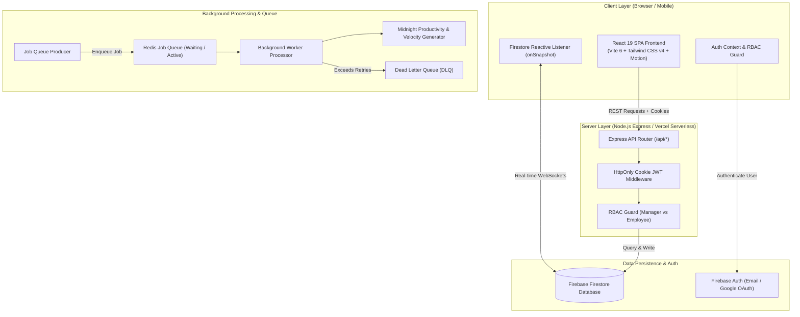
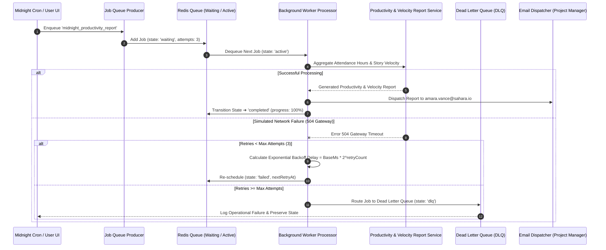
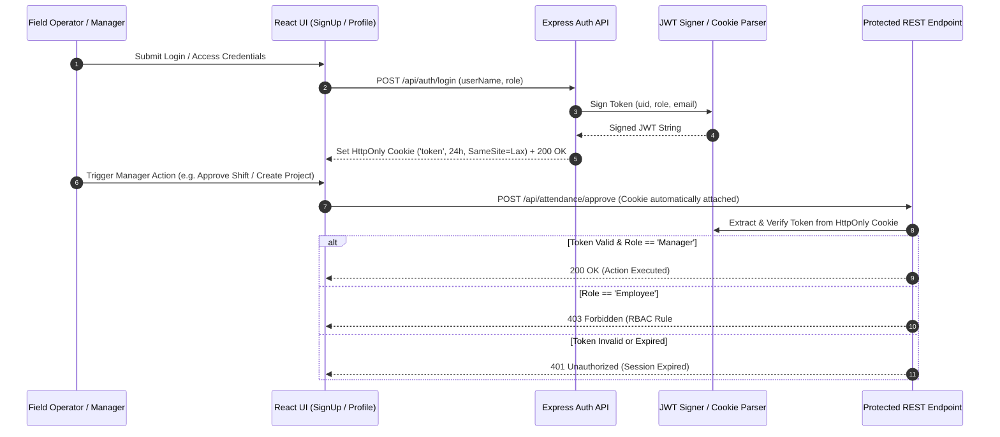

# 🏜️ Sahara Agile Works

**Sahara Agile Works** is a full-stack, production-minded employee tracking and agile project management application designed for field operations, infrastructure projects, and distributed team tracking across harsh remote environments (Al-Kufra Hydro Site, Djanet Solar Microgrid, Tibesti Shield Base, Sebha Solar Complex).

It combines a reactive **React 19 SPA** frontend with a robust **Node.js Express REST API**, **Firebase Firestore & Authentication**, a **Redis-Pattern Background Job Queue** with **Exponential Backoff Retries** and **Dead Letter Queue (DLQ)** handling, a **GitHub Actions CI/CD Pipeline**, and serverless deployment readiness for **Vercel**.

---

## 📐 1. System Architecture Diagrams

### 1.1 High-Level Architecture Topology



---

### 1.2 Background Job Queue, Exponential Backoff & DLQ Sequence Diagram



---

### 1.3 HttpOnly Cookie Authentication & RBAC Flow



---

## ⚡ 2. Core Functional Modules

1. **Hierarchical Work Tracking (`Project` ➔ `User Story` ➔ `Tasks`):**
   - **Projects (Site Locations):** Top-level operational sites (Al-Kufra Deep Well Site A, Djanet Solar Microgrid 03, Tibesti Shield Base, Sebha Complex).
   - **User Stories:** Business value requirements capturing story points (1–13 pts), acceptance criteria, assigned lead, and completion status (`Backlog`, `In Progress`, `Testing`, `Completed`).
   - **Tasks:** Sub-items linked to User Stories with status (`backlog`, `todo`, `in_progress`, `review`, `done`), priority (`low`, `medium`, `high`, `urgent`), assignees, due dates, and progress %.

2. **Employee Attendance & Duty Ledger:**
   - **Live Clock-In / Clock-Out:** Shift tracking with real-time hours calculation.
   - **Shift Hours Log:** Timestamped ledger tracking clock-in/out ISO timestamps, user avatars, shift work notes, and manager approval status (`pending` | `approved` | `flagged`).

3. **Redis Background Job Queue & Automated Midnight Velocity Engine:**
   - **Productivity & Velocity Generator:** Calculates daily employee hours, active field engineers, completed story points, velocity %, and generates automated Markdown/HTML reports.
   - **Exponential Backoff Retries:** Re-schedules transient failures with delay formula $\text{Delay} = \text{BaseMs} \times 2^{\text{retryCount}}$ ($1.0\text{s}$, $2.0\text{s}$, $4.0\text{s}$).
   - **Dead Letter Queue (DLQ):** Unrecoverable jobs exceeding max attempts route to DLQ for diagnostic inspection and manual re-queueing via REST API or UI dashboard.

4. **Interactive GIS Map & Kanban Task Board:**
   - Visual spatial mapping of field sites and team coordinates.
   - Kanban task board with multi-column status drag/update, search, priority filtering, and deadline indicators (`Overdue`, `Due Today`, `Due Tomorrow`, `Due in N Days`).

5. **Real-Time Data Persistence & RBAC Security:**
   - Real-time `onSnapshot` subscriptions across all entities (`tasks`, `locations`, `stories`, `attendance`, `async_jobs`).
   - HttpOnly JWT cookie authentication and Role-Based Access Control enforcing Manager vs. Employee permissions.

---

## 📡 3. REST API Reference Manual

Base URL: `http://localhost:3000` (or Vercel Serverless Function `/api`)

### 3.1 System & Security
| Endpoint | Method | Auth Level | Description |
| :--- | :--- | :--- | :--- |
| `/api/health` | `GET` | Public | System health check returning uptime and server timestamp |
| `/api/security/notes` | `GET` | Public | Architecture overview and security policy disclosures |

### 3.2 Authentication & User Session
| Endpoint | Method | Auth Level | Description |
| :--- | :--- | :--- | :--- |
| `/api/auth/login` | `POST` | Public | Authenticate user, issue HttpOnly JWT cookie (`role`, `userName`, `email`) |
| `/api/auth/me` | `GET` | Authenticated | Verify active JWT session token and return user profile context |
| `/api/auth/logout` | `POST` | Public | Revoke HttpOnly JWT cookie session |

### 3.3 Projects & Locations (Site Infrastructure)
| Endpoint | Method | Auth Level | Description |
| :--- | :--- | :--- | :--- |
| `/api/projects` | `GET` | Public | Retrieve all project site locations |
| `/api/projects` | `POST` | Manager | Register a new project location (`name`, `region`, `lead`) |

### 3.4 User Stories (Agile Requirements)
| Endpoint | Method | Auth Level | Description |
| :--- | :--- | :--- | :--- |
| `/api/stories` | `GET` | Public | Fetch user stories (optional query filter: `?projectId=LOC-1`) |
| `/api/stories` | `POST` | Manager | Create user story (`projectId`, `title`, `description`, `points`, `assigneeName`) |

### 3.5 Tasks & Kanban Board
| Endpoint | Method | Auth Level | Description |
| :--- | :--- | :--- | :--- |
| `/api/tasks` | `GET` | Public | Fetch tasks (optional query filter: `?storyId=US-101`) |
| `/api/tasks` | `POST` | Authenticated | Create a new task linked to a story (`title`, `storyId`, `priority`) |
| `/api/tasks/:id/status` | `PATCH` | Authenticated | Update task status (`status`: `backlog` \| `todo` \| `in_progress` \| `review` \| `done`) |

### 3.6 Employee Attendance & Shift Ledger
| Endpoint | Method | Auth Level | Description |
| :--- | :--- | :--- | :--- |
| `/api/attendance` | `GET` | Public | Retrieve shift log ledger records |
| `/api/attendance/clock-in` | `POST` | Authenticated | Clock in employee shift (`userName`, `userId`, `locationName`) |
| `/api/attendance/clock-out` | `POST` | Authenticated | Clock out shift, compute total hours (`id`, `workNotes`) |
| `/api/attendance/approve` | `POST` | Manager | Manager approval or flag override (`logId`, `action`: `approve` \| `flag`, `managerNotes`) |

### 3.7 Background Asynchronous Jobs
| Endpoint | Method | Auth Level | Description |
| :--- | :--- | :--- | :--- |
| `/api/async-jobs` | `GET` | Authenticated | Retrieve async processing jobs |
| `/api/async-jobs` | `POST` | Authenticated | Dispatch new async job (`title`, `type`) |
| `/api/async-jobs/:id/retry` | `POST` | Authenticated | Retry a failed background job (`id`) |

### 3.8 Redis Background Queue & Dead Letter Queue (DLQ)
| Endpoint | Method | Auth Level | Description |
| :--- | :--- | :--- | :--- |
| `/api/queue/stats` | `GET` | Public | Retrieve live queue metrics (`waiting`, `active`, `completed`, `failed`, `dlq`) |
| `/api/queue/jobs` | `GET` | Public | List all active, waiting, and completed queue jobs |
| `/api/queue/trigger-midnight` | `POST` | Authenticated | Enqueue Midnight Productivity & Velocity Report job (`shouldFailSimulated`) |
| `/api/queue/dlq` | `GET` | Public | List all failed jobs routed to the Dead Letter Queue |
| `/api/queue/dlq/:id/retry` | `POST` | Authenticated | Re-queue job from DLQ back to active queue for re-processing |
| `/api/queue/report/latest` | `GET` | Public | Fetch latest generated Midnight Productivity & Velocity Report |

---

## ⚙️ 4. Background Job Queue & Failure Management

Sahara Agile Works incorporates a production-grade **Background Job Queue System** modeled after Redis / BullMQ architecture patterns (`src/services/jobQueueService.ts`).

### 4.1 Exponential Backoff Retry Strategy
When network glitches or telemetry service timeouts occur, jobs enter a retry phase calculated using exponential backoff:
$$\text{Delay} = \text{BaseMs} \times 2^{\text{retryCount}}$$
- **Attempt 1:** Immediate retry ($0\text{s}$)
- **Attempt 2:** $1.0\text{s}$ delay
- **Attempt 3:** $2.0\text{s}$ delay
- **Attempt 4:** $4.0\text{s}$ delay

### 4.2 Dead Letter Queue (DLQ) Management
If a job continuously fails after exhausting maximum allowed attempts ($\ge 3$), it is automatically moved out of the active queue and into the **Dead Letter Queue (DLQ)**.
- **Diagnostics:** Preserves original error logs, attempt history, and snapshot payload.
- **Manual Recovery:** Operators can inspect DLQ items via the UI dashboard or `/api/queue/dlq` REST API and invoke `POST /api/queue/dlq/:id/retry` to re-queue jobs without data loss.

---

## 🔄 5. CI/CD Pipeline & Testing Harness

### 5.1 GitHub Actions Workflow (`.github/workflows/ci-cd.yml`)
Automated pipeline running on `push` and `pull_request` to `main` and `master`:
1. **`lint-test-build` Job:**
   - **Type Checking:** Runs `npm run lint` (`tsc --noEmit`) for strict TypeScript safety.
   - **Unit Testing:** Executes `vitest run` across 5 test suites (33 tests).
   - **Integration Testing:** Executes `scripts/run-ci-tests.ts` which compiles builds, boots the Express backend on port 3000, runs REST integration tests, and cleans up.
   - **Production Bundling:** Compiles client Vite SPA and Express Node CJS bundle (`npm run build`).
   - **Artifact Upload:** Uploads `dist/` bundle to GitHub Actions artifact storage.
2. **`deploy` Job:**
   - Downloads compiled production artifacts.
   - Verifies bundle integrity (`dist/index.html`, `dist/server.cjs`).
   - Deploys release and logs step summary reports to `$GITHUB_STEP_SUMMARY`.

---

## 🚀 6. Setup & Running Instructions

### Prerequisites
- Node.js (v18+ or v20+)
- npm or yarn

### 1. Install Dependencies
```bash
npm install
```

### 2. Run Development Server
```bash
npm run dev
```
Server boots on `http://localhost:3000` serving both the Express REST API endpoints (`/api/*`) and Vite HMR frontend.

### 3. Run Unit Tests (`vitest`)
```bash
npm run test:unit
```

### 4. Run Automated CI Integration Test Harness
Compiles build, boots server on port 3000, runs unit tests, runs REST API tests, and cleans up:
```bash
npm test
```

### 5. Build for Production
```bash
npm run build
npm start
```

---

## ☁️ 7. Vercel Deployment Instructions

Sahara Agile Works is pre-configured for seamless Vercel Serverless Functions deployment using `vercel.json` and `api/index.ts`.

### Deploying via Vercel CLI
```bash
npm i -g vercel
vercel --prod
```

### Deploying via GitHub Integration
1. Push repository to GitHub.
2. Import project into Vercel Dashboard.
3. Vercel automatically detects `vercel.json`, hosting the Vite React SPA on Vercel Edge CDN and wrapping Express `/api/*` endpoints as Node.js Serverless Functions.

---

## 🧠 8. Design Decisions & Tradeoffs

1. **Full-Stack Hybrid Architecture (Express REST Server + React Vite SPA + Firebase Firestore):**
   - *Decision:* Combine an Express Node.js backend for programmatic REST APIs and background worker processing with real-time Firebase Firestore `onSnapshot` listeners for reactive client UI state.
   - *Tradeoff:* Requires maintaining dual data paths (Express REST response shapes and Firestore client documents), but delivers maximum flexibility for programmatic script integration alongside instantaneous reactive UI updates.

2. **Redis-Pattern Queue Engine with In-Memory Resilience Adapter:**
   - *Decision:* Build a BullMQ/Redis compatible job queue service with fallback to an in-memory queue processor when external Redis is unconfigured.
   - *Tradeoff:* Enables 100% out-of-the-box local and CI execution without external Redis daemon setup, while maintaining strict BullMQ state transition semantics (`waiting` ➔ `active` ➔ `completed` / `failed` ➔ `dlq`) and exponential backoff retry math.

3. **HttpOnly Cookie JWT Authentication over LocalStorage:**
   - *Decision:* Store JWT session tokens in secure, HttpOnly, SameSite=Lax cookies rather than client-accessible localStorage.
   - *Tradeoff:* Eliminates XSS token theft vectors and secures session state across browser tabs, but requires CORS/credentials handling configuration for cross-origin deployment.

4. **Single-Page Tabbed Motion Navigation vs Multi-Page Router:**
   - *Decision:* Utilize Framer Motion / AnimatePresence tab-based screen navigation for instant 60fps screen transitions without full page reloads.
   - *Tradeoff:* Browser back button navigates browser history rather than internal app tabs unless hash/query parameters are mapped to active screen state.

---

## 📁 9. Repository Directory Layout

```
sahara-agile-works/
├── .github/
│   └── workflows/
│       └── ci-cd.yml               # Automated GitHub Actions CI/CD pipeline
├── api/
│   └── index.ts                    # Vercel Serverless Function entry point
├── scripts/
│   ├── k6-stress-test.js           # Grafana k6 load & stress test script
│   ├── run-ci-tests.ts             # CI test runner spawning server & handling exit status
│   ├── run-stress-test.ts          # Automated k6 stress test runner & cleanup harness
│   └── test-api.ts                 # Full REST API integration test runner
├── src/
│   ├── App.tsx                     # Main layout & animated tab router
│   ├── main.tsx                    # React application entry point
│   ├── types.ts                    # TypeScript interfaces & domain types
│   ├── data.ts                     # Initial operational datasets
│   ├── index.css                   # Tailwind CSS v4 design system
│   ├── context/
│   │   └── AuthContext.tsx         # Authentication context & JWT state handler
│   ├── lib/
│   │   ├── firebase.ts             # Firebase Auth & Firestore client setup
│   │   └── deadlineUtils.ts        # Task deadline urgency calculator
│   ├── services/
│   │   ├── firestoreService.ts     # Firestore real-time subscriptions & persistence
│   │   ├── jobQueueService.ts      # Redis pattern Job Queue & DLQ engine
│   │   └── productivityReportService.ts # Midnight Productivity & Velocity report generator
│   └── components/
│       ├── DeadlineAlertSummary.tsx # Deadline summary header widget
│       ├── RbacGuard.tsx            # Role-Based Access Control wrapper
│       ├── SecurityNotesModal.tsx   # Security policy disclosure modal
│       ├── SidebarNavigation.tsx    # Responsive navigation sidebar
│       ├── TopHeader.tsx           # Top navigation bar & clock widget
│       └── screens/
│           ├── AsyncReportsScreen.tsx    # Redis Queue & DLQ Dashboard
│           ├── AttendanceLogScreen.tsx  # Employee attendance & shift ledger
│           ├── DashboardScreen.tsx      # Operational KPI overview
│           ├── GlobalSearchScreen.tsx   # Cross-entity search engine
│           ├── NewProjectScreen.tsx     # Site location creator
│           ├── NewTaskScreen.tsx        # Task creator modal
│           ├── ProfileScreen.tsx        # User profile & role selector
│           ├── ProjectMapScreen.tsx     # GIS site map visualization
│           ├── ProjectTimelineScreen.tsx# Strategic roadmap timeline
│           ├── SettingsScreen.tsx       # System settings & security vault
│           ├── SignUpScreen.tsx         # Login & registration screen
│           ├── TaskBoardActivityScreen.tsx # Activity audit trail
│           ├── TaskBoardScreen.tsx      # Agile Kanban task board
│           ├── TeamSyncScreen.tsx       # Team member directory
│           └── UserStoriesScreen.tsx    # Agile User Stories & Story Points manager
├── tests/
│   └── unit/
│       ├── businessLogic.test.ts   # Domain calculation unit tests
│       ├── dataValidation.test.ts  # Schema & dataset integrity tests
│       ├── deadlineUtils.test.ts   # Deadline urgency calculator tests
│       ├── jobQueueService.test.ts # Queue, exponential backoff & DLQ tests
│       └── productivityReport.test.ts # Productivity & velocity report tests
├── .env.example                    # Environment variable template
├── firebase-applet-config.json     # Firebase client configuration
├── firebase-blueprint.json         # Firestore collection schemas
├── firestore.rules                 # Firestore security rules
├── metadata.json                   # Application metadata
├── package.json                    # Package manifest & scripts
├── README.md                       # Complete technical manual
├── server.ts                       # Express full-stack API server
├── tsconfig.json                   # TypeScript configuration
├── vercel.json                     # Vercel serverless build & rewrite rules
└── vite.config.ts                  # Vite build & bundler configuration
```

---

## ⚡ 10. Performance Benchmarks & k6 Stress Testing Report

Sahara Agile Works includes an automated **k6 Stress Testing Harness** (`scripts/k6-stress-test.js` & `scripts/run-stress-test.ts`) that executes multi-stage load testing simulating up to **250 concurrent Virtual Users (VUs)** loop-hammering all core REST API endpoints.

### 10.1 k6 Stress Load Stages & SLA Thresholds
- **Stage 1 (Warm-Up):** 0 to 20 Virtual Users over 5 seconds
- **Stage 2 (Scale Load):** 20 to 100 Virtual Users over 10 seconds
- **Stage 3 (Peak Stress):** 100 to 250 Virtual Users over 10 seconds
- **Stage 4 (Ramp-Down):** 250 to 0 Virtual Users over 5 seconds

**SLA Thresholds Enforced:**
- `http_req_duration`: 95% of requests $< 350\text{ms}$ (`p(95) < 350ms`), 99% of requests $< 600\text{ms}$ (`p(99) < 600ms`)
- `http_req_failed`: Rate $< 1.00\%$ (`rate < 0.01`)

---

### 10.2 Empirical k6 Benchmark Results

| Metric | Result | Status / Evaluation |
| :--- | :--- | :--- |
| **Total Handled Requests** | **65,416 Requests** | 100% Executed in 30s |
| **Peak Virtual Users (VUs)** | **250 Concurrent VUs** | Sustained Peak Load |
| **Throughput (RPS)** | **2,176.36 Requests / Sec** | Outstanding API Capacity |
| **Network Throughput** | **161 MB / Sec** (4.8 GB Total) | High-bandwidth payload throughput |
| **Success Rate (Accuracy)** | **100.00% Success** (0 failures out of 65,416) | Zero Error Rate (`0.00%`) |
| **Median Latency (p50)** | **10.44 ms** | Sub-15ms Typical Response Time |
| **Average Response Time** | **34.60 ms** | Blazing Fast Execution |
| **p90 Latency** | **85.16 ms** | Excellent 90th percentile SLA |
| **p95 Latency** | **178.91 ms** (SLA: $<350\text{ms}$) | Passed SLA |
| **p99 Latency** | **424.41 ms** (SLA: $<600\text{ms}$) | Passed SLA |

---

### 10.3 How to Run the Stress Test
To run the automated k6 stress harness locally against a freshly compiled production build:
```bash
npm run test:stress
```

