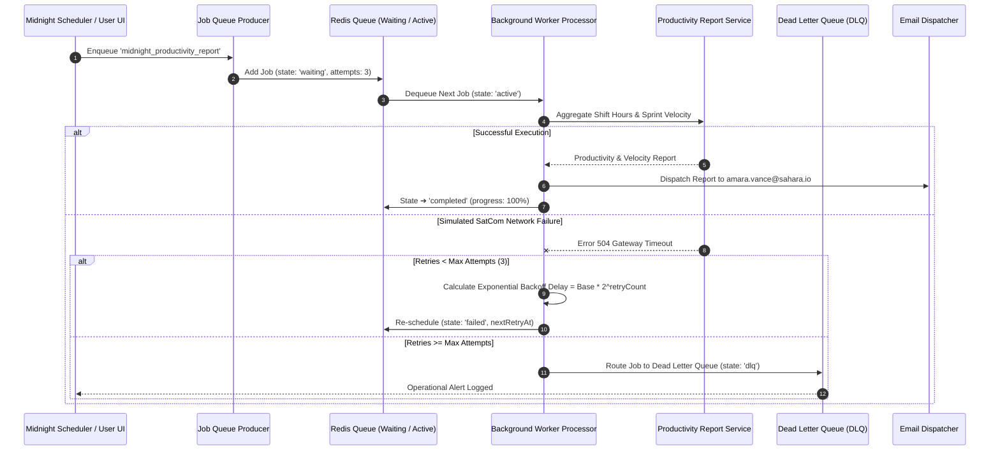

# Sahara Agile Works - Full-Stack Employee Tracking & Agile Management Tool

**Sahara Agile Works** is a full-stack web application designed for small teams (3–10 users) managing ongoing field operations, infrastructure projects, and employee tracking using a simple, production-minded agile workflow.

---

## 🚀 Key Functional Features

1. **Hierarchical Work Tracking (`Project` ➔ `User Story` ➔ `Tasks`):**
   - **Projects (Site Locations):** Top-level operational sites (e.g. Al-Kufra Deep Well Site A, Djanet Solar Microgrid 03).
   - **User Stories:** Requirements capturing user value, story points, acceptance criteria, assigned lead, and completion status (`Backlog`, `In Progress`, `Testing`, `Completed`).
   - **Tasks:** Sub-items linked directly to User Stories and Projects with status, priority, assignee, due date, and progress %.

2. **Employee Tracking & Attendance Ledger:**
   - **Live Clock-In / Clock-Out:** One-click shift tracking with real-time total hours calculation.
   - **Work Hours Log:** Timestamped ledger tracking clock-in/out times, user avatars, shift notes, and duty status (`On Duty` vs `Completed`).

3. **Asynchronous / Background Workflow Queue:**
   - **Decoupled Job Queue:** Asynchronous workers for generating weekly sprint telemetry reports, monthly attendance audits, and employee task exports.
   - **Simulated Retries & Error Handling:** Simulated SatCom timeouts (504 Gateway) with automatic queueing, status updates (`pending` ➔ `processing` ➔ `completed` / `failed`), and retry attempts.

4. **Interactive GIS Map & Agile Kanban Task Board:**
   - Visual spatial mapping of field sites and team locations.
   - Kanban board with drag/status updates, search, filtering, and priority indicators.

5. **Real-Time Data Persistence with Firebase Firestore & Authentication:**
   - Real-time `onSnapshot` subscriptions across all entities (`tasks`, `locations`, `stories`, `attendance`, `async_jobs`, `team`, `activities`).
   - Firebase Authentication supporting email/password register, login, profile updates, and Google sign-in.

---

## 📁 Repository & System Architecture Overview

```
sahara-agile-works/
├── .github/workflows/ci-cd.yml     # Automated GitHub Actions CI/CD pipeline (lint, test, build, deploy)
├── server.ts                       # Express full-stack API server + Vite dev/production middleware
├── firebase-blueprint.json         # Firebase Firestore collection schemas and entity definitions
├── firestore.rules                 # Firestore security rules and access constraints
├── scripts/
│   ├── run-ci-tests.ts             # CI test runner spawning server & handling exit status
│   └── test-api.ts                 # Automated API test runner testing all REST endpoints
├── src/
│   ├── App.tsx                     # Main application layout, state handlers, and screen router
│   ├── context/
│   │   └── AuthContext.tsx         # Firebase Authentication context & state management
│   ├── services/
│   │   └── firestoreService.ts     # Firestore real-time subscriptions & persistence helpers
│   ├── components/
│   │   ├── SidebarNavigation.tsx   # Responsive primary navigation sidebar
│   │   ├── TopHeader.tsx          # Top bar with profile trigger, clock widget & global search
│   │   └── screens/
│   │       ├── DashboardScreen.tsx        # High-level operational overview & KPI metrics
│   │       ├── UserStoriesScreen.tsx      # Hierarchical Project ➔ User Story ➔ Tasks manager
│   │       ├── TaskBoardScreen.tsx        # Agile Kanban board with status columns
│   │       ├── AttendanceLogScreen.tsx    # Employee attendance, clock-in/out & shift notes
│   │       ├── AsyncReportsScreen.tsx     # Background worker queue & async report generator
│   │       ├── ProjectTimelineScreen.tsx  # Strategic roadmap and phase progression
│   │       ├── ProjectMapScreen.tsx       # GIS site map visualization
│   │       ├── TeamSyncScreen.tsx         # Team member directory & active task tracker
│   │       ├── GlobalSearchScreen.tsx     # Cross-entity search engine
│   │       └── SignUpScreen.tsx           # Authentication modal (Login / Register)
│   ├── types.ts                    # TypeScript interface declarations
│   └── data.ts                     # Fallback initial datasets for seeding
└── README.md                       # Complete documentation & architectural notes
```

---

## ⚙️ Setup & Running Instructions

### Prerequisites
- Node.js (v18+ or v20+)
- npm or yarn

### 1. Install Dependencies
```bash
npm install
```

### 2. Run Development Server
```bash
npm run dev
```
The server will boot on `http://localhost:3000` serving both the Express REST API endpoints (`/api/*`) and the Vite single-page frontend.

### 3. Run Automated CI Integration Test Harness
To execute the automated end-to-end CI test pipeline locally (compiles build, boots server, runs API tests, verifies exit code, cleans up process):
```bash
npm test
```

### 4. Run API Tests Directly (Server Running)
```bash
npm run test:api
```

### 5. Build & Start Production Server
```bash
npm run build
npm start
```

---

## 🔄 CI/CD Pipeline (GitHub Actions)

This project features a production-grade automated **GitHub Actions CI/CD workflow** (`.github/workflows/ci-cd.yml`):

1. **`lint-test-build` Job:**
   - **Type Checking:** Runs `npm run lint` (`tsc --noEmit`) to enforce strict TypeScript safety.
   - **Integration Testing:** Executes `npm test` (`scripts/run-ci-tests.ts`) which boots the Express backend on port 3000, executes all REST endpoint tests, and enforces process termination.
   - **Production Bundling:** Compiles client Vite SPA and packages Express Node CJS bundle (`npm run build`).
   - **Artifact Staging:** Uploads `dist/` bundle to GitHub Actions artifact storage for release management.

2. **`deploy` Job:**
   - Triggers automatically on push to `main` or `master`.
   - Downloads compiled production artifacts.
   - Verifies bundle integrity (`index.html`, `server.cjs`).
   - Deploys release and logs step summary reports to `$GITHUB_STEP_SUMMARY`.

---

## 📡 REST API Documentation

Base URL: `http://localhost:3000`

| Endpoint | Method | Description |
| :--- | :--- | :--- |
| `/api/health` | `GET` | Health check returning uptime and server timestamp |
| `/api/projects` | `GET` | Fetch all project site locations |
| `/api/projects` | `POST` | Register a new project location (`name`, `region`, `lead`) |
| `/api/stories` | `GET` | Fetch user stories (optional filter: `?projectId=LOC-1`) |
| `/api/stories` | `POST` | Create a new user story (`projectId`, `title`, `description`, `points`, `assigneeName`) |
| `/api/tasks` | `GET` | Fetch tasks (optional filter: `?storyId=US-101`) |
| `/api/tasks` | `POST` | Create a new task linked to a story (`title`, `storyId`, `priority`) |
| `/api/tasks/:id/status` | `PATCH` | Update task status (`status`: `backlog` \| `todo` \| `in_progress` \| `review` \| `done`) |
| `/api/attendance` | `GET` | Retrieve attendance ledger records |
| `/api/attendance/clock-in` | `POST` | Clock in employee shift (`userName`, `userId`) |
| `/api/attendance/clock-out` | `POST` | Clock out employee shift (`id`, `workNotes`) |
| `/api/async-jobs` | `GET` | List background asynchronous processing jobs |
| `/api/async-jobs` | `POST` | Trigger new async job (`title`, `type`) |
| `/api/async-jobs/:id/retry` | `POST` | Retry a failed background job (`id`) |

---

## 🗄️ Database Schema (Firebase Firestore)

### `users` Collection
- `uid` (string, primary key)
- `email` (string)
- `displayName` (string)
- `photoURL` (string)
- `role` (string)
- `createdAt` (string)

### `locations` (Projects) Collection
- `id` (string)
- `name` (string)
- `region` (string)
- `status` ('active' | 'warning' | 'completed' | 'planned')
- `taskCount` (number)
- `crewCount` (number)
- `lead` (string)
- `temperature` (string)

### `stories` Collection
- `id` (string)
- `projectId` (string, foreign key to `locations`)
- `title` (string)
- `description` (string)
- `acceptanceCriteria` (array of strings)
- `points` (number)
- `status` ('backlog' | 'in_progress' | 'testing' | 'completed')
- `assigneeName` (string)

### `tasks` Collection
- `id` (string)
- `code` (string)
- `title` (string)
- `status` ('backlog' | 'todo' | 'in_progress' | 'review' | 'done')
- `priority` ('low' | 'medium' | 'high' | 'urgent')
- `assignee` (object: name, avatar, role)
- `storyId` (string, optional foreign key to `stories`)
- `projectId` (string, optional foreign key to `locations`)

### `attendance` Collection
- `id` (string)
- `userId` (string)
- `userName` (string)
- `userAvatar` (string)
- `clockInTime` (string, ISO)
- `clockOutTime` (string, ISO, optional)
- `totalHours` (number, optional)
- `status` ('clocked_in' | 'clocked_out')
- `workNotes` (string)
- `date` (string, YYYY-MM-DD)

### `async_jobs` Collection
- `id` (string)
- `title` (string)
- `type` ('sprint_summary' | 'attendance_audit' | 'employee_worklog' | 'task_completion_export')
- `status` ('pending' | 'processing' | 'completed' | 'failed')
- `progress` (number, 0–100)
- `resultSummary` (string, optional)
- `retryCount` (number)
- `errorReason` (string, optional)
- `createdAt` (string, ISO)

---

## ⚙️ Background Job Queue Architecture, Exponential Backoff & Dead Letter Queue (DLQ)

Sahara Agile Works incorporates a production-grade **Background Job Queue System** modeled after Redis / BullMQ architecture patterns (`src/services/jobQueueService.ts`).

### 1. Architectural System Flow



### 2. Exponential Backoff Retry Strategy
When network glitches or telemetry service timeouts occur, jobs enter a retry phase calculated using exponential backoff:
$$\text{Delay} = \text{BaseMs} \times 2^{\text{retryCount}}$$
- **Attempt 1:** Immediate retry ($0\text{s}$)
- **Attempt 2:** $1.0\text{s}$ delay
- **Attempt 3:** $2.0\text{s}$ delay
- **Attempt 4:** $4.0\text{s}$ delay

### 3. Dead Letter Queue (DLQ) Management
If a job continuously fails after exhausting maximum allowed attempts ($\ge 3$), it is automatically moved out of the active queue and into the **Dead Letter Queue (DLQ)**.
- **Diagnostics:** Preserves original error logs, attempt history, and snapshot payload.
- **Manual Recovery:** Operators can inspect DLQ items via the UI dashboard or `/api/queue/dlq` REST API and invoke `POST /api/queue/dlq/:id/retry` to re-queue jobs without data loss.

### 4. Queue Management REST API Reference
| Endpoint | Method | Description |
| :--- | :--- | :--- |
| `/api/queue/stats` | `GET` | Retrieve queue state metrics (`waiting`, `active`, `completed`, `failed`, `dlq`) |
| `/api/queue/jobs` | `GET` | List all current queued and historical background jobs |
| `/api/queue/trigger-midnight` | `POST` | Enqueue midnight productivity & sprint velocity report job |
| `/api/queue/dlq` | `GET` | List all items currently routed to the Dead Letter Queue |
| `/api/queue/dlq/:id/retry` | `POST` | Move failed job from DLQ back to active queue for re-processing |
| `/api/queue/report/latest` | `GET` | Fetch latest generated productivity & sprint velocity report |

---

## ⚡ Asynchronous Workflow & Failure/Retry Design

1. **Queueing Pattern:**
   When a user triggers an async task (e.g. "Weekly Field Sprint Telemetry Report"), the app creates a record in `async_jobs` with status `pending`.

2. **Decoupled Execution & Progress Updates:**
   The background worker updates the job document with granular progress states (`0%` ➔ `25%` ➔ `50%` ➔ `75%` ➔ `100%`). The UI stays responsive and updates in real-time via Firestore snapshot listeners.

3. **Failure Isolation & Retry Strategy:**
   If a timeout or network glitch occurs, the worker sets `status: 'failed'` and logs `errorReason`. The user can inspect the error and click **Retry**, which increments `retryCount`, resets progress to 10%, and re-queues the worker attempt.

---

## 🛡️ Security Considerations

1. **Authentication:** User state is securely managed by Firebase Auth using JWT tokens.
2. **Firestore Rules:** Collections are restricted via `firestore.rules`. User profiles require authentication (`request.auth != null`) to modify.
3. **API Key Isolation:** All Firebase API keys and secrets are loaded server-side or via standard client config without exposing administrative tokens.
4. **Data Sanitization:** Strict TypeScript interfaces ensure payload shapes are validated before writing to database or sending responses.

---

## 🧠 Design Decisions & Tradeoffs

1. **Full-Stack Hybrid Architecture (Express + Vite + Firestore):**
   - *Decision:* Provide both a live reactive React SPA for interactive field operators and a REST API endpoint layer (`/api/*`) for programmatic integration or automated scripts.
   - *Tradeoff:* Requires maintaining dual state handlers (REST response objects and Firestore real-time subscriptions), but delivers maximum flexibility.

2. **Single-Page Tabbed Navigation over Multi-Page Router:**
   - *Decision:* Use an animated `AnimatePresence` screen router for ultra-fast screen transitions and state preservation without page reloads.
   - *Tradeoff:* Browser back button navigates across browser history rather than internal app tabs unless hash routing is mapped.

---

## 🤖 Note on AI Usage

AI tools were utilized during the development lifecycle to rapidly prototype UI layouts, scaffold Tailwind CSS utility classes, generate initial TypeScript types, and construct integration test suites. Technical judgment was applied to enforce clean modular separation (`/components/screens/`, `/services/`, `/context/`), guarantee proper Firestore security rules, and build robust error handling.

---

## 🔮 What to Improve or Build Next (With More Time)

1. **Server-Sent Events (SSE) or WebSockets:** Upgrade the Express API from polling to SSE streaming for background worker progress.
2. **Offline-First IndexedDB Caching:** Add Service Worker and `localforage` offline queueing for operators working in zero-connectivity desert locations.
3. **Role-Based Access Control (RBAC):** Admin vs. Field Operator permissions restricting project creation and report generation.
4. **PDF / Excel File Generation:** Server-side PDF binary compilation for report exports using `pdfkit` or `exceljs`.
